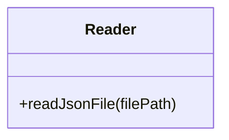
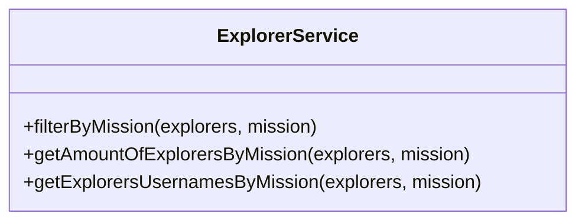
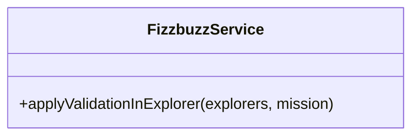

# 1 Refactoring

Felicidades explorer, eres parte del equipo de backend de [Visual Partner-Ship](https://twitter.com/visual_partner). 

Actualmente se necesita calcular cierta información de los explorers de LaunchX, de momento se ha desarrollado por una consultoría externa muy mala un script en JS para realizar esto. Sin embargo después de una evaluación interna se ha decidido refactorizar totalmente el proyecto, y esta es tu primer set de tareas a realizar.

Este proyecto lee un archivo `explorers.json` que contiene una lista de explorers con información que necesitamos procesar. Con este script se logró:
- Obtener la lista de explorers que solo están en node.
- Obtener la cantidad de explorers que están en node.
- Obtener la lista de usuarios de github de los explorers que están en node.
- Se necesitó crear una validación llamada FizzBuzz, si el explorer tiene un score que sea divisible entre 3 (revisa cómo hacer esto), deberá tener un campo `trick` que diga `FIZZ`, cualquier otro caso el valor de este nuevo campo deberá ser el score mismo. Esta validación nos sirve porque necesitamos aplicarla a la lista de todos los explorers y saber cuáles son FIZZ.
- Después necesitamos una validación muy similar pero para cuando el score sea divisible entre 5, entonces el valor del nuevo campo `trick` será BUZZ, cualquier otro caso el valor será el score.
- Pero después volvimos a necesitar otro caso para cuando el valor del score fuera divisible entre 3 y también entre 5, entonces el valor del campo `trick` debe ser FIZZBUZZ, de lo contrario tendrá el valor del score. 

Actualmente las últimas 3 validaciones se corren independientemente y se juntan en un excel. Se necesita una misma validación que apliqué las tres reglas a toda la lista:
- Si el campo score del explorer es divisible entre 3, entonces se agrega un campo nuevo llamado `trick` cuyo valor será `FIZZ`.
- Si el campo score del explorer es divisible entre 5, entonces se agrega un campo nuevo llamado `trick` cuyo valor será `BUZZ`.
- Si el campo score del explorer es divisible entre 3 y 5, entonces se agrega un campo nuevo llamado `trick` cuyo valor será `FIZZBUZZ`.
- Si el campo score no es divisible por ninguna de las reglas anteriores, se agrega un campo nuevo llamado `trick` cuyo valor será el del score.

Requerimientos:

1. Refactorizar el script legado y rehacerlo con mucho cuidado ya que es información muy sensible.
2. Crea un API para usar la funcionalidad anterior:

| Endpoint | Request | Response |
|---|---|---|
| `localhost:3000/v1/explorers/:mission` | `localhost:3000/v1/explorers/node` | Deberás obtener la lista de explorers en la misión que enviaste (node o java) |
| `localhost:3000/v1/explorers/amount/:mission` | `localhost:3000/v1/explorers/amount/node` | Deberás obtener la cantidad de explorers según la misión que enviaste (node o java) |
| `localhost:3000/v1/explorers/usernames/:mission` | `localhost:3000/v1/explorers/usernames/node` | Deberás obtener la lista de usernames en la misión que enviaste (node o java) |

3. Nuevo requerimiento: Crea un endpoint para recibir un número y aplicar la validación del fizzbuzz. (ESTO SE DEBE CREAR DESDE CERO)

# Requerimiento 1: Lee y entiende el proyecto

1. Crea un nuevo proyecto de js en tu equipo
  - Recuerda versionarlo
  - Recuerda usar `npm init -y`
2. Crea un script llamado `app.js` y pega el snippet de código de abajo.
3. Crea un script llamado `explorers.json` y pega el snippet de abajo correspondiente.
4. Lee todo el script, ejecútalo por partes, entiende qué hace. ¿Qué tanto puedes entender?

Recuerda que este código realiza lo siguiente:
- Obtener la lista de explorers que solo están en node.
- Obtener la cantidad de explorers que están en node.
- Obtener la lista de usuarios de github de los explorers que están en node.
- Se necesitó crear una validación llamada FizzBuzz, si el explorer tiene un score que sea divisible entre 3 (revisa cómo hacer esto), deberá tener un campo trick que diga FIZZ, cualquier otro caso el valor de este nuevo campo deberá ser el score mismo. Esta validación nos sirve porque necesitamos aplicarla a la lista de todos los explorers y saber cuáles son FIZZ.
- Después necesitamos una validación muy similar pero para cuando el score sea divisible entre 5, entonces el valor del nuevo campo trick será BUZZ, cualquier otro caso el valor será el score.
- Pero después volvimos a necesitar otro caso para cuando el valor del score fuera divisible entre 3 y también entre 5, entonces el valor del campo trick debe ser FIZZBUZZ, de lo contrario tendrá el valor del score.

<details>
<summary> app.js & explorers.json </summary>

`app.js`
```javascript
const fs = require("fs");

// Part 1 Read json file ===========================
const rawdata = fs.readFileSync("explorers.json");
const explorers = JSON.parse(rawdata);

// Part 2: Get the quantity of explorers names in node
const explorersInNode = explorers.filter((explorer) => explorer.mission == "node");
//console.log(explorersInNode.length)

// Part4: Get the explorer's usernames in Node
const explorersInNodeToGetUsernames = explorers.filter((explorer) => explorer.mission == "node");
const usernamesInNode = explorersInNodeToGetUsernames.map((explorer) => explorer.githubUsername);
//console.log(usernamesInNode)

// DEAD CODE: Part 5,6,7, please remove this and go to Part 8!

// Part 5: Get a new list of explorers in node, if the score numbers is divisible by 3, I need a new propery called trick, and the value assigned is FIZZ, if not the value should be the score itself.
// Score: 3, Trick: FIZZ.
// Score: 4, Trick: 4.
// Score: 5, Trick: 5.

const assignFizzTrick = function(explorer){
    if(explorer.score%3 === 0){
        explorer.trick = "FIZZ";
        return explorer;
    }else{
        explorer.trick = explorer.score;
        return explorer;
    }
};

const explorersInNodeAndFizzTrick = explorersInNode.map((explorer) => assignFizzTrick(explorer));

// Part 6: Get a new list of explorers in node if the score number is divisible by 5, we need to set a new property called trick and set the value BUZZ, if not this value should be just the score
//
const assignBuzzTrick = function(explorer){
    if(explorer.score%5 === 0){
        explorer.trick = "BUZZ";
        return explorer;
    }else{
        explorer.trick = explorer.score;
        return explorer;
    }
};

const explorersInNodeAndBuzzTrick = explorersInNode.map((explorer) => assignBuzzTrick(explorer));

//Part7: Get a new list of explorers in Node, if the score number is divisible by 3 AND by 5 we need to set a new property called FIZZBUZZ, if not this value should be the same score value

const assignFizzBuzzTrick = function(explorer){
    if(explorer.score%5 === 0 && explorer.score%3 === 0){
        explorer.trick = "FIZZBUZZ";
        return explorer;
    }else{
        explorer.trick = explorer.score;
        return explorer;
    }
};

const explorersInNodeAndFizzBuzzTrick = explorersInNode.map((explorer) => assignFizzBuzzTrick(explorer));

// Part 8: Get a list of the explorers in node, if the score is divisible by 5 and 3, set the property trick and the value FIZZBUZZ, if is just divisible by 5 set the property trcik and the value BUZZ, if is just divisible by 3 set the property trick and the value FIZZ, otherwise set the property trick and the score value. TODO

```

  `explorers.json`
``` json
[
{
  "name": "Woopa1",
  "githubUsername": "ajolonauta1",
  "score": 1,
  "mission": "node",
  "stacks": [
    "javascript",
    "reasonML",
    "elm"
  ]
},
{
  "name": "Woopa2",
  "githubUsername": "ajolonauta2",
  "score": 2,
  "mission": "node",
  "stacks": [
    "javascript",
    "groovy",
    "elm"
  ]
},
{
  "name": "Woopa3",
  "githubUsername": "ajolonauta3",
  "score": 3,
  "mission": "node",
  "stacks": [
    "elixir",
    "groovy",
    "reasonML"
  ]
},
{
  "name": "Woopa4",
  "githubUsername": "ajolonauta4",
  "mission": "node",
  "score": 4,
  "stacks": [
    "javascript"
  ]
},
{
  "name": "Woopa5",
  "githubUsername": "ajolonauta5",
  "score": 5,
  "mission": "node",
  "stacks": [
    "javascript",
    "elixir",
    "elm"
  ]
},
{
  "name": "Woopa6",
  "githubUsername": "ajolonauta6",
  "score": 6,
  "mission": "java",
  "stacks": [
    "elm"
  ]
},
{
  "name": "Woopa7",
  "githubUsername": "ajolonauta7",
  "mission": "java",
  "score": 7,
  "stacks": [
  ]
},
{
  "name": "Woopa8",
  "githubUsername": "ajolonauta8",
  "score": 8,
  "mission": "java",
  "stacks": [
    "elm"
  ]
},
{
  "name": "Woopa9",
  "githubUsername": "ajolonauta9",
  "score": 9,
  "mission": "java",
  "stacks": [
    "javascript",
    "elixir",
    "groovy",
    "reasonML",
    "elm"
  ]
},
{
  "name": "Woopa10",
  "githubUsername": "ajolonauta10",
  "score": 10,
  "mission": "java",
  "stacks": [
    "javascript",
    "elixir",
    "groovy",
    "reasonML",
    "elm"
  ]
},
{
  "name": "Woopa11",
  "githubUsername": "ajolonauta11",
  "score": 11,
  "mission": "node",
  "stacks": [
    "javascript",
    "elixir",
    "groovy",
    "reasonML",
    "elm"
  ]
},
{
  "name": "Woopa12",
  "githubUsername": "ajolonauta12",
  "score": 12,
  "mission": "node",
  "stacks": [
    "javascript",
    "elixir",
    "groovy",
    "reasonML",
    "elm"
  ]
},
{
  "name": "Woopa13",
  "githubUsername": "ajolonauta13",
  "score": 13,
  "mission": "node",
  "stacks": [
    "javascript",
    "elixir",
    "groovy",
    "reasonML",
    "elm"
  ]
},
{
  "name": "Woopa14",
  "githubUsername": "ajolonauta14",
  "score": 14,
  "mission": "node",
  "stacks": [
    "javascript",
    "elixir",
    "groovy",
    "reasonML",
    "elm"
  ]
},
{
  "name": "Woopa15",
  "githubUsername": "ajolonauta15",
  "score": 15,
  "mission": "node",
  "stacks": [
    "javascript",
    "elixir",
    "groovy",
    "reasonML",
    "elm"
  ]
}
] 
```  
  
</details>

# Parte 1 Refactoring

Muy bien, después de tomarte el tiempo de correr lo anterior, revisar cada punto y qué esta realizando, vamos a refactorizarlo juntos. Ahora vamos a tener que modularizar este script en Orientación a Objetos para darle una mejor estructura.

Crearemos lo siguiente:
- `Reader`: en esta clase necesitaremos un método static para leer el archivo y obtener la información dado el nombre archivo.
- `ExplorerService`: aquí vamos poner tres métodos static para obtener lo que se necesita realizar con la lista de explorers. En este service vamos a realizar todas las operaciones de filtrado y mapeo que se necesiten.
- `FizzbuzzService`: aquí haremos un método static para aplicar la validación sobre un explorer y agregarle el campo que se necesita.







5. Refactor de la lectura del archivo.
 
Dado que se esta leyendo un archivo json para obtener la lista de explorers, necesitamos crear una clase para separa esta responsabilidad.

- Crea el archivo y carpetas en `lib/utils/Reader.js`.
- Dentro crea una clase llamada `Reader`.
- Crea un método static llamado `readJsonFile` que reciba un path (este deberá ser el path al archivo a leer).
- Dentro de esta función tendrás que guardar la lógica para leer el archivo y regresar la información (esta lógica ya está en el script inicial).
- No olvides importar el módulo del filesystem `const fs = require("fs");`
- Te dejó aquí cómo deberíamos poder usar tu nuevo servicio para leer un archivo json:

```javascript
const Reader = require("./lib/utils/Reader");
const explorers = Reader.readJsonFile("explorers.json"); // esto regresa la lista de explorers del archivo
```

6. Explorer Service

Vamos a refactorizar la lógica que se ejecuta sobre la lista de explorers.
- Crea el archivo `lib/services/ExplorerService.js`.
- Crea una clase `ExplorerService`.
- Crea los métodos: `static filterByMission(explorers, mission)`, `static getAmountOfExplorersByMission(explorers, mission)`, `static getExplorersUsernamesByMission(explorers, mission)`.
- No olvides exportar tu clase vía common JS.

Te dejó un ejemplo de cómo vamos a utilizar tu nueva clase en el proyecto:
```javascript
// Clase anterior con la que obtenemos los explorers
const Reader = require("./lib/utils/Reader");
const explorers = Reader.readJsonFile("explorers.json");

// Aplicación del ExplorerService sobre la lista de explorers
ExplorerService.filterByMission(explorers, "node");
ExplorerService.getAmountOfExplorersByMission(explorers, "node");
ExplorerService.getExplorersUsernamesByMission(explorers, "node");
```

7. FizzBuzz Service

Este service necesita mayor lógica por desarrollar, necesitas entender el script legado muy bien.

- Crea un archivo `lib/services/FizzbuzzService.js`
- Crea una clase `FizzbuzzService` y no olvides exportarla.
- Crea un método `static applyValidationInExplorer(explorer)`, este método recibirá un explorer.

Validaciones:
``` javascript
const explorer1 = {name: "Explorer1", score: 1}
FizzbuzzService.applyValidationInExplorer(explorer1) // {name: "Explorer1", score: 1, trick: 1} 

const explorer3 = {name: "Explorer3", score: 3}
FizzbuzzService.applyValidationInExplorer(explorer3) // {name: "Explorer3", score: 3, trick: "FIZZ"}

const explorer5 = {name: "Explorer5", score: 5}
FizzbuzzService.applyValidationInExplorer(explorer5) // {name: "Explorer5", score: 5, trick: "BUZZ"}

const explorer15 = {name: "Explorer15", score: 15}
FizzbuzzService.applyValidationInExplorer(explorer15) // {name: "Explorer15", score: 15, trick: "FIZZBUZZ"}
```

8. Muy bien, cuando hayas escrito las tres clases anteriores respectivamente, sube tu proyecto a algún repo de GitHub.
9. No olvides que aquí ya DAMOS POR HECHO QUE TODO PROYECTO LLEVA PRUEBAS DE UNIDAD. (Para este punto infiero que ya agregaste jest y ya agregaste todas las pruebas a cada clase que hiciste.)

# Automatización Pruebas GitHub Actions

Si no tienes pruebas no estás autorizado para ninguna entrega ni para avanzar en el proyecto.

10. Crea un nuevo archivo con la ruta: `.github/workflows/test.yml`
11. Copia el siguiente contenido:

```yml
name: Run Tests in my project every push on GitHub

on: [push]

jobs:
  build:
    runs-on: ubuntu-latest
    steps:
    - uses: actions/checkout@v1
    - name: Run Jest
      uses: stefanoeb/jest-action@1.0.3
```

Este es un GitHub Action que automatizará la ejecución de las pruebas cada vez que hagas PUSH a tu repositorio de GitHub.

12. Haz commit y súbelo a tu repo en GitHub.
13. Ve a la sección de `Actions` y verifica que exista un workflow en ejecución:


¡Felicidades! Ya tienes la automatización de pruebas de unidad en tu repo de GitHub. 😁

14. Modifica una prueba en tu proyecto, y haz que truene. Hazle commit en ese estado y súbela a tu repo en GitHub. Ve a la sección de Actions y verifica que el workflow de pruebas este en ejecución. Espera a que terminé, deberá fallar por la prueba que agregaste, mirá e inspecciona el workflow:


15. Arregla tu prueba de nuevo, que pase, hazle commit y súbela a tu repo en GitHub. Esta vez el GitHub Action deberá pasar también. (No olvides borrar tu archivo `app.js` porque ya esta refactorizado.)

# Linter

JS y cada lenguaje tienen herramientas para ayudarnos a cuidar la legibilidad en nuestro código, se les conoce como linters. 

16. Instala ESLint en tu proyecto

> npm install eslint --save-dev

17. Ejecuta el comando para generar la configuración del linter:

> npm init @eslint/config


Al finalizar esto te creará un archivo `.eslintrc.js` con la configuración del linter.

18. Agrega tu configuración, haz que tu archivo `.eslintrc.js` se parezca a este:

```javascript
module.exports = {
    "env": {
        "browser": true,
        "commonjs": true,
        "es2021": true,
        "jest": true
    },
    "extends": "eslint:recommended",
    "parserOptions": {
        "ecmaVersion": "latest"
    },
    "rules": {
        indent: ["error", 4],
        "linebreak-style": ["error", "unix"],
        quotes: ["error", "double"],
        semi: ["error", "always"]
    }
};
```

Los rules son reglas que podemos decirle al Linter que revise en nuestros archivos, nos ayudan a detectar mejoras de escritura.

Es indispensable revisar la documentación de cada dependencia que usemos: https://eslint.org/docs/rules/

19. Automatiza los comandos de eslint en tu package.json (recuerda que la ruta dentro de node_modules puede variar en windows)

```
  "scripts": {
    "test": "node ./node_modules/.bin/jest",
    "linter": "node ./node_modules/eslint/bin/eslint.js .",
    "linter-fix": "node ./node_modules/eslint/bin/eslint.js . --fix"
  }
```

20. Ejecuta `npm run linter` para que el linter se ejecute y te diga todas las inconsistencias de escritura.


21. El Linter arregla todos estos detalles por ti. Corre `npm run linter-fix` y tus archivos ahora quedarán con el mejor formato.

Felicidades, cada vez le estás dando mejor calidad a tu trabajo. ¡Sigue así!

# Guía de Estilo

A partir de ahora usaremos el linter para darle formato a nuestro scripts, y seguiremos algunos estándares.
- Ve al siguiente repo: https://github.com/airbnb/javascript
- Haz un fork para que quede una copia para ti.
- Utiliza este nuevo fork para leer el estilo estándar que se usa en Airbnb para escribir JS.
- Toma esta guía de referencia para escribir JS.
- Comparte tu experiencia.

