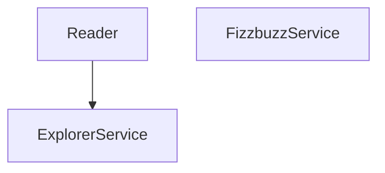
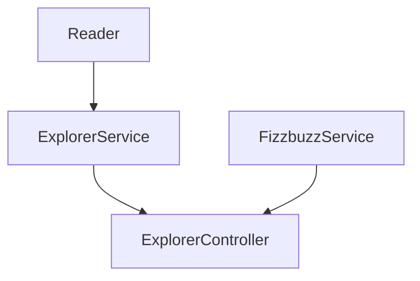
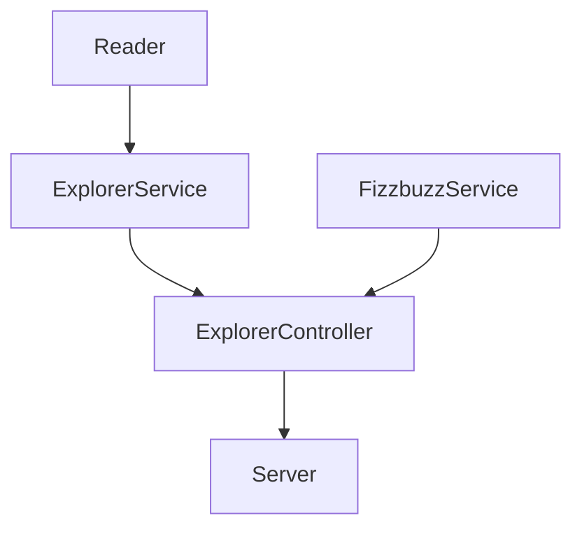

# 2 Crea un API para exponer nuestras funcionalidades

| Endpoint | Request | Response |
|---|---|---|
| `localhost:3000/v1/explorers/:mission` | `localhost:3000/v1/explorers/node` | Deberás obtener la lista de explorers en la misión que enviaste (node o java) |
| `localhost:3000/v1/explorers/amount/:mission` | `localhost:3000/v1/explorers/amount/node` | Deberás obtener la cantidad de explorers según la misión que enviaste (node o java) |
| `localhost:3000/v1/explorers/usernames/:mission` | `localhost:3000/v1/explorers/usernames/node` | Deberás obtener la lista de usernames en la misión que enviaste (node o java) |

Muy bien, hasta ahora creamos las clases para refactorizar el script legado, ya tenemos:
- Funcionalidad en clases
- Estructura de directorios
- Pruebas
- Pruebas automatizadas en GitHub
- Linter

Nuestra estructura de directorios esta:

- Carpeta `services`: Tenemos dos clases para realizar toda la lógica que se necesita
- Carpeta `utils`: Aquí tenemos una clase para leer un archivo json.

Necesitamos usar estas funcionalidades para exponerlas con un API, esto nos ayudará a poder conectar aplicaciones de clientes que requerieren nuestros servicios. Para ellos nuestros clientes nos han solicitado el API que se refirió.

# API con express

Estas son las clases que tenemos hasta ahora que nos permiten implementar la lógica legada anteriomente:



Ahora necesitamos crear otra clase que nos permita extender un puente entre funcionalidad y el server que vamos a crear:



Para que en el server que será el API solo se comuniqué a partir de ahí:



La separación de clases y directorios nos ayuda a tener una estructura pero también una separación de responsabilidades. 
- Services: clases para aplicar lógica que necesitemos usando modelos.
- Utils: clases auxiliares.
- Controllers: Uso de exclusivo de services.


# Creando controller para conectar la funcionalidad con el server

1. Crea el archivo `lib/controllers/ExplorerController.js`
2. Importa las clases `ExplorerService`, `FizzbuzzService` y `Reader`.
3. No olvides exportar tu clase.
4. Crea un método para obtener la lista de explorers filtrados por misión:
  - Crea un método static `getExplorersByMission`, recibe un parámetro llamado `mission`. 
  - Dentro de este llama la función del Reader `Reader.readJsonFile("explorers.json")` para obtener la lista de explorers del archivo json.
  - Llama el método de `ExplorerService` para filtrar por misión, usa tu parámetro `mission` y la lista de explorers.
  - Regresa el resultado obtenido.

5. Crea un método `static getExplorersUsernamesByMission(mission)` y regresa la lista de usernames de los explorers filtrados por la misión enviada.
6. Crea un método `static getExplorersAmonutByMission(mission)` y regresa la cantidad de explorers en la misión enviada.

Recuerda que estás funcionalidades ya las tienes, tienes que leer la lista de explorers, y aplicar tus funciones del ExplorerService. No olvides tus pruebas.

# Creando server con API

7. Crea un script en `lib/server.js`.
8. Crea un servidor de express.
  - Instala express.
  - Crea un server básico.
  - Ejecuta tu server: `node lib/server.js`
  - Entra en tu navegador a `localhost:3000` y verifica que vez tu mensaje. 
  - Automatiza tu `package.json` para automatizar tu server, agrega la siguiente línea dentro de `scripts`: `"server": "node ./lib/server.js"`. Después solo tendrás que usar `npm run server` para iniciar tu servidor. 
  
`Server Básico server.js`
```javascript
const ExplorerController = require("./controllers/ExplorerController");
const express = require("express");
const app = express();
app.use(express.json());
const port = 3000;

app.get("/", (request, response) => {
    response.json({message: "FizzBuzz Api welcome!"});
});

app.listen(port, () => {
    console.log(`FizzBuzz API in localhost:${port}`);
});
```

9. Importa tu controller. 
10. Crea el primer endpoint para recibir un parámetro por query params, y regresar la lista de explorers filtrados por el parámetro.

| Endpoint | Request | Response |
|---|---|---|
| `localhost:3000/v1/explorers/:mission` | `localhost:3000/v1/explorers/node` | Deberás obtener la lista de explorers en la misión que enviaste (node o java) |


Notas:
- Este es un método GET que va a devolver información cuando se consulte.
- La url de este endpoint será: `localhost:3000/v1/explorers/:mission` (:mission es un query param)
- Puedes probar esta url con `localhost:3000/v1/explorers/node` o `localhost:3000/v1/explorers/java`.
- El query param que se envia por la url lo puedes recibir como `const mission = request.params.mission;`.
- Revisa como regresar información: `response.json(explorersInMission)`
- Prueba estos ejemplos en tu navegador visitando las urls de ejemplo. 
- Prueba enviar otros valores en el query param.

11. Crea otro endpoint para regresar la cantidad de explorers según la misión que se envíe. 

- Dentro de tu endpoint puedes regresar un objeto con el nombre de la misión y la cantidad: `response.json({mission: request.params.mission, quantity: explorersAmountInMission});`

| Endpoint | Request | Response |
|---|---|---|
| `localhost:3000/v1/explorers/amount/:mission` | `localhost:3000/v1/explorers/amount/node` | Deberás obtener la cantidad de explorers según la misión que enviaste (node o java) |


12. Crea el último endpoint para regresar la lista de usernames de los explorers filtrados por la misión.

| Endpoint | Request | Response |
|---|---|---|
| `localhost:3000/v1/explorers/usernames/:mission` | `localhost:3000/v1/explorers/usernames/node` | Deberás obtener la lista de usernames en la misión que enviaste (node o java) |


Felicidades, ya creaste el API que necesitamos. 

¿Qué tan difícil fue conectar esto con la funcionalidad anterior?

No olvides:
- Poner punto y coma al final de cada línea.
- Si no lo hiciste, corre el lint para que te arregle eso.
- Sube tu código a GitHub y verifica que el action corra tus pruebas y pasen.
- Si tus pruebas automatizadas no pasan, arréglalo.
