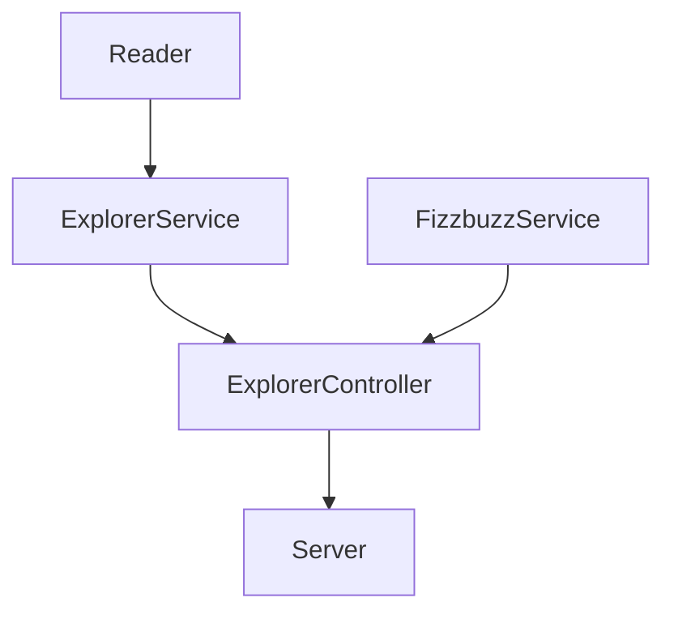
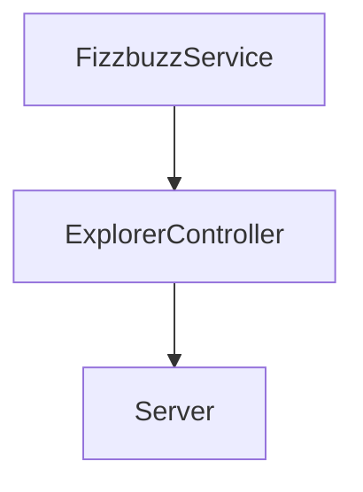

# Parte 3: Nuevo requerimiento

Ahora que tenemos ya lo que queríamos, es decir, ya refactorizamos nuestro script legado y ya creamos un API para exponer esa funcionalidad al mundo de nuestros clientes. 

Tenemos un nuevo cliente que necesita parte de lo que ya tenemos pero de diferente forma. Es decir, el enviará un score, y nosotros le daremos lo correspondiente al trick. Esa validación es la que ya tenemos en FizzbuzzService. Pero ahora no necesitamos agregarle un campo a ningún explorer, solo regresar la palabra 'Fizz', 'Buzz', 'Fizzbuzz' o el score mismo, según es el caso. Cobraremos por cada request que recibamos.

Nuevo requerimiento: Crea un endpoint para recibir un número y aplicar la validación del fizzbuzz. (ESTO SE DEBE CREAR DESDE CERO)

| Endpoint | Request | Response |
|---|---|---|
| `localhost:3000/v1/fizzbuzz/:score` | `localhost:3000/v1/fizzbuzz/1` | `{score: 1, trick: 1}` |
| `localhost:3000/v1/fizzbuzz/:score` | `localhost:3000/v1/fizzbuzz/3` | `{score: 3, trick: "Fizzz"}` |
| `localhost:3000/v1/fizzbuzz/:score` | `localhost:3000/v1/fizzbuzz/5` | `{score: 5, trick: "Buzz"}` |
| `localhost:3000/v1/fizzbuzz/:score` | `localhost:3000/v1/fizzbuzz/15` | `{score: 15, trick: "Fizzbuzz"}` |

# Diseño actual

# Flujo de Nueva funcionalidad

De entrada el único punto de conexión que debe haber entre nuestra funcionalidad y el server será el `ExplorerController`. Así vamos a mantener una organización y separación de responsabilidades adecuado. 

Se creará la nueva funcionalidad dentro de `FizzbuzzService`, misma que será usada en el `ExplorerController` y de ahí podrá ser implementada en el server.

1. Crea un nuevo método `static applyValidationInNumber(number){` en `FizzbuzzService`.
  - Implementa la validación de fizzbuzz, solo regresa el valor: "Fizz", "Buzz", "Fizzbuzz" o el mismo número recibido.

2. Crea un nuevo método en `ExplorerController` que reciba un número y use la función del `FizzbuzzService` que acabas de crear.
3. Finalmente usa este método dentro de un nuevo endpoint en el server. Aquí te dejo un ejemplo de cómo se debería ver tu nuevo endpoint:

No olvides agregar pruebas, correr tu linter, subir a GitHub y ver que el Action funcione.
